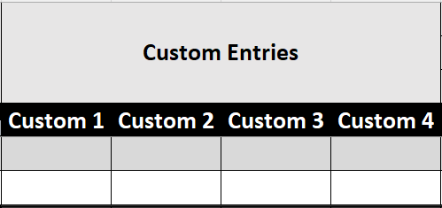
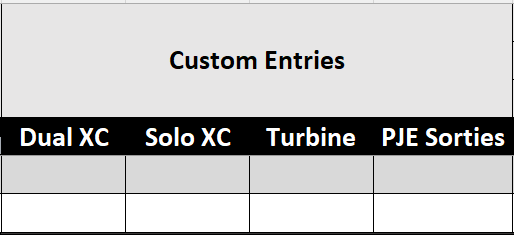

# Electronic Logbook

A Microsoft Excel-based pilot logbook with automatic update delivery via GitHub. Designed for Australian general aviation, it supports single-engine and multi-engine operations, instrument currency tracking, approach logging, and route mapping.

> **Download:** For normal use, download the latest `Electronic_Logbook_Master.xlsm` from the repository's GitHub Releases page rather than cloning the repository.

---

## Changelog
### [2.1.0] - 2026-07-15
#### General
- 

### [2.0.2] - 2026-07-14
#### General
- Reissued the latest master workbook with improved privacy protections.

### [2.0.1] - 2026-07-14
#### General
- Added a warning when a route's recorded time implies an unusually high average speed.
- Improved the master workbook used to start a new logbook.

#### Updater
- Fixed bug preventing users from being able to update workbooks when not connected to File Sharing service.

### [2.0.0] - 2026-07-13
#### General
- Improved workbook opening feedback so Excel shows what the logbook is working on during startup.
- Redesigned the Logbook and New Entry sheets so route details are entered in separate fields: Flight ID, From, To, Via, and Remarks.
- Expanded airport data to better support international flying, with improved airport visit and base-airport statistics.
- Updated route map handling to use the new route fields, with prompts to rebuild route data when needed.

#### Updater
- Improved the update process for this larger upgrade, including better backups, clearer error messages, and extra checks that migrated logbooks were saved correctly.
- Added an Update Compatibility Floor of `v1.4.1`

#### New Entry
- Added direct checkboxes for Flight Review, IPC, and OPC entries, replacing the old currency verification pop-up.
- Added clearer New Entry warnings, including highlighted fields when something needs to be fixed or reviewed.
- Added airport-code suggestions and warnings for unrecognised departure, destination, or via airports.

#### Logbook
- Added new **Delete Selected Rows** button to allow deleting entries with workbook protection
- Added **Export Logbook** feature, to allow for XLSX, CSV, and PDF exports

#### Currency + Recency
- Adjusted table layout to more accurately show which items are specific to Engine Class
- Fixed some incorrectly calculating recency items

#### Stats
- Added **Base** table, allowing user to select and deselect their Base Airports, sorted by Top 10 visits

### [1.4.2] - 2026-06-25
- Improved protected Logbook row deletion for removing placeholder entries
- Reduced Add To Logbook sorting work when new entries are already in date order
- Fixed updated workbooks reopening with sheet tabs scrolled behind the tab navigation button
- Updated Logbook totals formatting to follow the selected table palette
- Added scripted upload support for updater wizard release assets

### [1.4.1] - 2026-06-22
- Fixed route table rebuilds being blocked by workbook protection

### [1.4.0] - 2026-06-20
- Hardened GitHub release protections and automated release checks
- Added release asset checksums and machine-readable integrity metadata
- Added automated VBA source-quality and workbook/source consistency checks
- Improved release preparation tooling and workbook maintainability
- Added an early external updater prototype that creates and validates a separate updated copy
- Added runtime workbook protection with development/release toggles
- Added automatic redacted diagnostics capture when starting a bug report
- Hardened update migration against protected-sheet failures and staging/backup validation gaps
- Improved Hours Over Time chart update resilience so entry saves are not blocked by chart wiring issues
- Added wizard-first update launch with legacy VBA fallback if the external updater is unavailable
- Added in-place updater handoff with timestamped `_Old` backup retention and original filename preservation

### [1.3.1] - 2026-06-14
- Added an anonymous bug report form that can be opened directly from the logbook

### [1.3.0] - 2026-06-14
- Overhauled Currency + Recency section
  - Added Single/Multi Engine distinction
  - Added Flight Review tracking
  - Fixed Passenger Carrying recency incorrectly calculating expiry date
  - Added Currency Validity Check button, allowing users to disqualify entries that have incorrectly been recorded as a Flight Review, IPC, or OPC
- General UI updates/improvements
- Improved speed of sheet when entering data in new entries

### [1.2.1] - 2026-06-01
- Updated public-repository GitHub requests to retry without authentication when an old workbook contains a stale private-repo token
- Added a fallback to the public `main` branch when an old workbook still points update checks at `dev`
- Refreshed the release workbook so future downloads include the token fallback in the embedded updater bootstrap
- Cleared the workbook privacy flag on files created by the update process so AutoSave stays available after updating

### [1.2.0] - 2026-06-01
- Prepared the project for public repository release
- Added public security, contribution, and licensing information
- Added release checks to prevent publishing workbooks with private update tokens

### [1.1.2] - 2026-05-30
- Fixed some Recency items that were calculating incorrectly
- Added currency/recency tracking for OPCs

### [1.1.1] - 2026-05-25
- Fixed incorrect airports showing in route history

### [1.1.0] - 2026-05-23
- New entries are now sorted into date order automatically
- Route map data is now kept during updates where possible
- The logbook will ask to rebuild route map data when it needs refreshing
- Improved the Hours by Year chart after adding entries or updating
- If date reset is set to "today", the New Entry date now resets when the file opens
- The "next day" date reset now moves to the day after the entry you just added

### [1.0.10] - 2026-05-18
- Added Warning for Excel Trust Center not being enabled
- Added option to Reset day to one day after the last entry, on completion of export

### [1.0.9] - 2026-05-11
- Rearranged New Entry page, for better readability and usage of space

### [1.0.8] - 2026-04-30
- Ensured updated files would save inside the current folder, rather than in My Documents
- Added more diagnostic logs for crashes and errors
- Fixed issue where update process could download old/cached version

### [1.0.7] - 2026-04-26
- Added ability to choose whether Date resets to Today, or remains as-is, after Export
- Added button to Suppress All Warnings for 24 hours
- Added Debug Logs in the event of an excel crash

### [1.0.6] - 2026-04-16

- Added PDF Readme
- Ensured table formatting would stay the same after update
- Ensured most recent version of update process would always be used

### [1.0.5] - 2026-04-15

- Back-end fixes
- Reformatted Admin page, added reminders to not modify values

### [1.0.4] - 2026-04-14

- Fixed issue where macros would break on original copy of spreadsheet after update

### [1.0.3] - 2026-04-14

- Added 'Help' page with Readme access to Spreadsheet

### [1.0.2] - 2026-04-14

- Formatted Custom Logbook Entries
- Ensured most up-to-date process followed for updating Logbook

### [1.0.1] - 2026-04-14

- Added automatic update access handling

### [1.0.0] - 2026-04-13

Initial release.

---

## Features

- Structured flight data entry with hard and soft validation
- Automatic currency and recency calculations (passenger carrying, IFR, NVFR, IPC, OPC, and Flight Review)
- Cumulative and statistical analysis across the full logbook
- Charts: hours by year, hours by type, hours by registration, hours over time
- Airport visit tracking with visit counts and base flagging
- Route map export compatible with [kepler.gl](https://kepler.gl)
- Route map rebuild prompts only when needed
- Automatic update system -- when a new version is published, users are prompted to update on next open

---

## Requirements

- Microsoft Excel for Windows
  - Primary supported: Microsoft 365 on Windows 11
  - Supported perpetual: Excel 2021 and newer
  - Older versions are best-effort only
- Macros must be enabled
- For automatic updates: internet access on the machine running the logbook

---

## Getting Started

### 1. Download the logbook

Download `Electronic_Logbook_Master.xlsm` from the latest GitHub Release. This is your personal copy -- rename it if you wish (e.g. `Electronic_Logbook_YourName.xlsm`).

> **Note:** You will receive a 'Build Routes Table' dialog when you open it. Press 'Yes'. You only need to do this the first time, or when a future update needs to refresh route map data.

### 2. Enable macros

When you first open the file, Excel will display a security warning at the top of the screen:

> **"SECURITY WARNING: Macros have been disabled."**

Click **Enable Content**. The logbook will not function correctly without macros enabled.

### 3. Enable Trust Access to the VBA Project

This setting ensures the logbook can automatically update its own VBA code when a new version is released. Without it, formula and sheet updates will still be applied, but VBA module updates will not.

To enable:

1. Go to **File -> Options -> Trust Center -> Trust Center Settings**
2. Select **Macro Settings**
3. Check **"Trust access to the VBA project object model"**
4. Click OK

This is a one-time setting per machine.

Only enable macros and VBA project access for workbooks downloaded from this repository's GitHub Releases page. Do not run modified copies from untrusted sources.

### 3a. Workbook protection behaviour

The release workbook may run in protected mode to reduce accidental edits. Intended input areas remain editable, including New Entry (`ne*`) fields, supported override/settings cells, and editable Logbook table data.

Protection follows the workbook's `GitHubBranch` named range:

- `dev`: protection is removed automatically each time the workbook opens.
- `main`: protection is applied automatically each time the workbook opens.

For development workflows, protection mode can be toggled persistently with macros:

1. `DisableProtectionForDevelopment` sets `GitHubBranch` to `dev` and removes protection.
2. `EnableProtectionForRelease` sets `GitHubBranch` to `main` and applies protection.

Preparation scripts also attempt to call these macros automatically:

- `PrepareForTesting.ps1` sets `GitHubBranch` to `dev`, so protection stays off across launches.
- `PrepareForRelease.ps1` sets `GitHubBranch` to `main`, so protection is restored for release.

### 4. First open -- build the Routes table

On first open, you will be prompted to build the Routes table. This scans your logbook entries and constructs a table of all departure/arrival pairs, which is used for the route map export. Click **Yes** when prompted. This may take a few seconds depending on the size of your logbook.

This prompt will not appear again after the initial build unless a later update needs to refresh route map data. Routes are updated automatically each time a new logbook entry is added.

---

## Starting a New Logbook

1. Download `Electronic_Logbook_Master.xlsm` from this repository
2. Rename it to something personal (e.g. `Electronic_Logbook_YourName.xlsm`)
3. Open the file and enable macros when prompted
4. If you store the file in OneDrive and Excel shows **AUTOSAVE TURNED OFF** with a warning about personal information, turn off the privacy flag for your personal copy:
   1. Navigate to File > Info > Inspect Workbook
   2. Click the button that says `Allow this information to be saved in your file`
5. On first open, click **Yes** when prompted to build the Routes table (it will be empty at this stage, which is fine -- it will populate as you add entries)
6. Navigate to the **New Entry** sheet and begin entering your flights

> **Note:** The logbook contains two placeholder entries by default. Do not delete these until you have added at least two of your own entries, as they are required to maintain the correct table and formula structure.

### Adding a Logbook Entry

Always add entries using the **New Entry** sheet -- do not attempt to add rows manually to the Logbook table. Manual row insertion will bypass validation and may break formulas and table structure.

1. Navigate to the **New Entry** sheet
2. Fill in the date, aircraft details, crew, and flight time fields
3. Click **Add to Logbook**

After an entry is added, the Logbook table is automatically sorted by Date. Depending on your date reset setting, the New Entry date can reset to today or to the day after the entry you just added.

Use the **FR**, **IPC**, and **OPC** checkboxes on the New Entry sheet to record qualifying currency items. These selections feed the relevant currency and recency calculations; they are not inferred from the Remarks field.

Only tick **OPC** for a qualifying operator proficiency check that covered IFR operations. Qualifying OPC entries feed the 61.870 3-month recency exemption. If an OPC also qualifies as an IPC for 61.880 proficiency validity or circling currency, tick **IPC** as well; the IPC checkbox is the source of truth for those calculations.

The entry form includes validation that will warn you of potential errors before saving, including:

- Invalid or future dates
- Zero total hours
- Landings recorded without corresponding hours (and vice versa)
- Approaches recorded without instrument hours
- IFR hours exceeding total hours
- OPC recorded without instrument hours or approaches
- Potential duplicate entries

Some checks will prevent saving (hard errors), while others prompt you to confirm before continuing (warnings).

### Modifying Existing Entries

You can edit existing entries directly in the **Logbook** sheet. The following rules apply:

- **Do not edit the Date column.** The Date column is calculated automatically and is read-only. To change a date, edit the **Year**, **Month**, and **Day** columns instead.
- All other data columns (Type, Reg, PIC, hours, landings, approaches etc.) can be edited directly.

### Deleting Entries

To delete one or more logbook entries:

1. In the **Logbook** sheet, select one or more cells in the entry row(s) you want to remove
2. Click **Delete Selected** below the Logbook table
3. Confirm the deletion when prompted

Use the **Delete Selected** button instead of Excel's right-click **Delete** command. The Logbook sheet is protected to prevent accidental formula edits, and Excel may block native row deletion while protected formula cells are present.

> **Important:** Do not delete the placeholder entries until you have added at least two of your own entries. The placeholder rows are required to maintain the correct table and formula structure during the initial setup period.

### Creating Custom Columns
There are 4 preset custom columns in the Logbook

Simply edit the Headers in the Logbook table to your desired category. For example:

---

## Updating the Logbook

When a new version is available, you will see a prompt when opening the file:

> **"A new version of the Electronic Logbook is available!"**

Click **Yes** to update. The update process will:

1. Launch the external updater wizard when available (or use legacy VBA update as fallback)
2. Build and validate a staged updated workbook from the latest master
3. Rebuild all charts and pivot tables
4. Rename your previous file to `[YourFilename]_Old_<timestamp>.xlsm`
5. Keep the updated logbook on your original filename

Once the update is complete, close the `_Old` file and reopen your logbook from the original filename.

> **Note:** If your file is stored in a OneDrive folder that is synced via a cloud URL, the old and updated files may be saved to your Documents folder instead, under `Electronic Logbook\`. You can move them back to your OneDrive folder afterwards.

### What is preserved during an update

The following data is carried across from your existing logbook to the updated version:

| Data | Preserved |
|---|---|
| All flight log entries (Year through Circling) | Yes |
| All other logbook columns (formulas, cumulative totals) | Rebuilt from master |
| Airport list | Rebuilt from master |
| IPC, OPC, and Flight Review Keywords | Preserved |
| Routes table | Preserved where possible; you will be prompted if it needs to be rebuilt |
| Charts and pivot tables | Rebuilt from master |
| VBA code | Updated from master |

### Manual update check

You can check for updates at any time by running the `CheckForUpdateManual` macro from the Developer tab or by wiring it to a button on any sheet.

### Backup and recovery actions

The workbook now includes user-triggered safety actions you can run from the Developer tab or wire to buttons:

- `BackupCurrentWorkbook` creates a timestamped backup copy beside your workbook.
- `RestorePreviousVersion` finds the latest `_Old` backup, creates a restored copy, and opens it for review.
- `RebuildRoutesTableNow` rebuilds the Routes table on demand.
- `ExportDiagnostics` writes a redacted diagnostics snapshot for support.

---

## Troubleshooting

### Macros are disabled and I cannot enable them

If you downloaded the file from the internet, Windows may have blocked it. Right-click the file in Explorer, select **Properties**, and check **"Unblock"** at the bottom of the General tab. Then re-open the file.

### My charts look wrong or are not displaying data correctly

Press **Ctrl+Alt+F5** to refresh all data connections and pivot tables. This will force all charts to recalculate from the current logbook data.

### The update prompt appears but the update fails

Check that you have an active internet connection. If the problem persists, note the error step and error number shown in the failure dialog and raise an issue on this repository.

### The Routes table is empty after an update

You will be prompted to rebuild it on first open of the updated file. If you accidentally dismissed the prompt, you can rebuild manually by running the `RebuildRoutesTableNow` macro from the Developer tab.

### Route map export says routes may be out of date

This appears when your route map data may need refreshing. Choose **Yes** to rebuild the Routes table before exporting.

### The HoursByYear chart is not grouped correctly after an update

Open the **ChartData** sheet, locate the **HoursByYear** pivot table, and:
1. Remove **Date** from the Rows field
2. Press **Ctrl+Alt+F5** to refresh all
3. Re-add **Date** to the Rows field

### Currency calculations seem incorrect

Check that the **Currency + Recency** sheet is not using an overridden date. There is a manual override field for the IPC/IFR date -- if this has been set, clear it to return to automatic calculation.

---

## File Structure

| File | Purpose |
|---|---|
| `Electronic_Logbook_Master.xlsm` | Master template -- distributed to users and used as the update source |
| `modBoot.bas` | Embedded launcher that checks for updates and starts the external updater wizard |
| `modUpdate.bas` | Legacy VBA updater retained for older supported workbooks; not embedded in release workbooks by default |
| `version.txt` | Current version number -- checked on workbook open |
| `README.md` | This file |

---

## Licence

This project is shared for personal, non-commercial use. See [LICENSE.md](LICENSE.md).

## Security

If you believe you have found a security issue, please follow [SECURITY.md](SECURITY.md) rather than opening a public issue.
